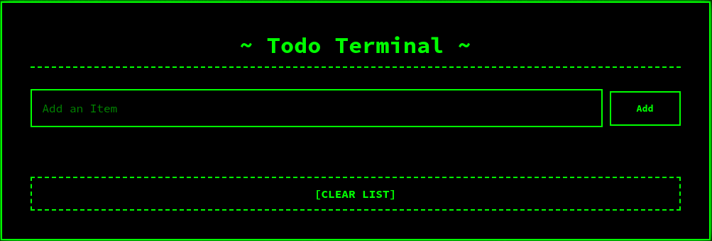

# Terminal Todo

A retro-themed, terminal-inspired Todo app built with React.



## Features

- **Terminal UI:** Styled to look like a hacker terminal, complete with animated background noise.
- **Add/Edit/Delete Todos:** Manage your tasks easily.
- **Persistent Storage:** Todos are saved in your browser’s localStorage.
- **Responsive Design:** Works well on mobile and desktop.
- **Clear All:** Remove all tasks with a single click.
- **Footer Animation:** Typing animation in the footer for extra flair.

## Getting Started

### Prerequisites

- [Node.js](https://nodejs.org/) (v14 or higher recommended)
- [npm](https://www.npmjs.com/) (comes with Node.js)

### Installation

1. Clone this repository:
   ```sh
   git clone https://github.com/yourusername/terminal-todo.git
   cd terminal-todo
   ```

2. Install dependencies:
   ```sh
   npm install
   ```

### Running Locally

Start the development server:
```sh
npm start
```
Open [http://localhost:3000](http://localhost:3000) to view it in your browser.

### Building for Production

```sh
npm run build
```
The production-ready files will be in the `build/` directory.

## Project Structure

- `src/` - React source code
  - [`App.js`](src/App.js) - Main app component
  - [`components/todoreact/todo.js`](src/components/todoreact/todo.js) - Todo logic and UI
  - [`components/todoreact/style.css`](src/components/todoreact/style.css) - Terminal-inspired styles
- `public/` - Static assets and HTML template
- `build/` - Production build output

## Credits

- Built by Kanishk Jain
- Inspired by classic terminal UIs

## License

MIT License